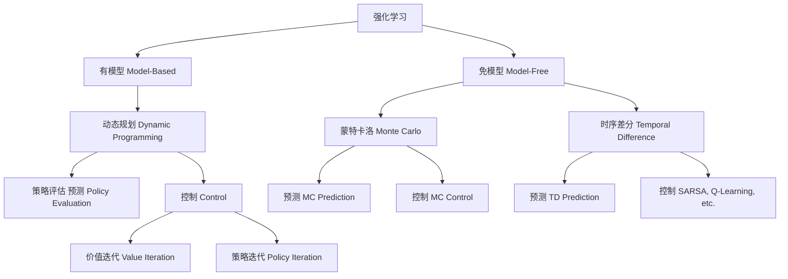
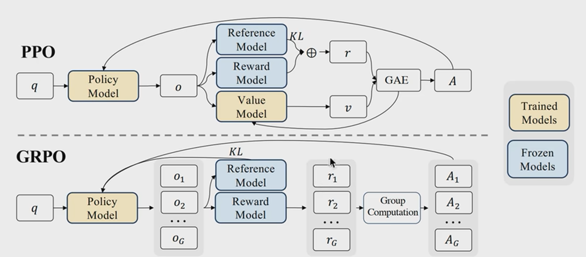
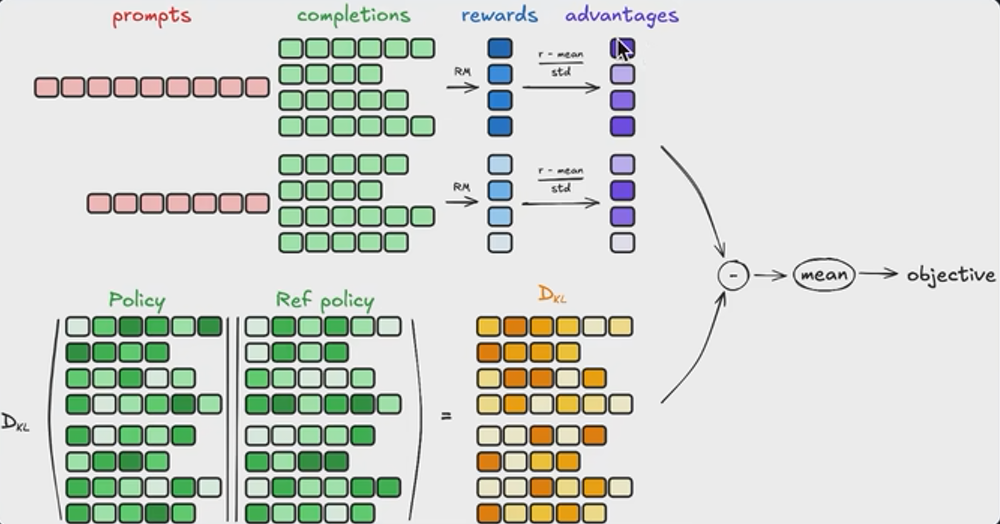

# 强化学习：重生之我要成为CEO
**——让算法在KPI暴击中学会职场生存法则**

---
## 第一章：这个RL究竟是什么鬼？
### 正经学术定义
> 通过与环境的交互学习最优决策策略，以最大化累积奖励的机器学习范式
### 1.1 肤浅定义
> "在老板眼皮底下偷学升职秘籍的玄学"
- **监督学习**：领导手把手教你怎么写PPT
- **无监督学习**：没人管你在茶水间瞎琢磨
- **强化学习**：每次方案被驳回都偷偷记小本本
**<span style="color:red">1. 输入的样本是序列数据</span>  
<span style="color:red">2. 奖励信号是延迟的，即环境会在很久以后告诉我们之前我们采取的动作到底是不是有效的</span>
<span style="color:red">3. 强化学习的核心在于通过与环境的交互学习一个最优策略，从而在不确定和动态的环境中最大化长期累计奖励</span>**
---

### 1.2 为什么需要强化学习呢？

#### 传统方法的"困境"
```python
# 监督学习の死板
if 任务 in 知识库:
    照抄前任方案
else:
    raise "这题领导没教过！"

# 无监督学习の佛系
分析所有会议记录 → 生成词云图 → 依然不知道PPT怎么写
```
#### 三大学派の终极对决
| **学习类型**   | **监督学习**               | **无监督学习**           | **强化学习**                 |
|----------------|---------------------------|-------------------------|-----------------------------|
| **数据饲料**    | 带标签的(输入,输出)对      | 无标签数据              | 状态-动作-奖励序列          |
| **终极目标**    | 复现标准答案              | 发现数据内在结构        | 最大化长期奖励              |
| **反馈机制**    | 即时明确的错误提示        | 无明确反馈              | 延迟且稀疏的奖励信号        |
| **人类比喻**    | 学霸刷五年高考三年模拟    | 艺术家在垃圾堆找灵感    | 社畜在KPI迷雾中摸爬滚打      |

---
**<span style="color:red">监督学习：标签的获取代价往往较为昂贵</span>**  
**<span style="color:red">强化学习：更加符合人认识世界的过程</span>**

### 1.3 深入定义


#### 1.3.1 状态 (State)
- **辅助理解**：  
  状态就好比你在职场中的各个“身份”：可能是忙得团团转的打工人，也可能是统筹全局的CEO，每个状态都反映了当前你所处的环境情景。
- **定义**：  
  在强化学习中，状态 \( s \in S \) 是描述环境在某一时刻所有必要信息的变量集合。状态必须满足马尔可夫性，即未来的决策只依赖于当前状态，而与过去无关。

#### 1.3.2 动作 (Action)
- **辅助理解**：  
  动作是你在职场中能做出的选择——是加班、喝咖啡偷懒，还是冒险向老板提出创新方案，每个选择都可能改变你晋升的轨迹！
- **定义**：  
  动作 \( a \in A \) 是智能体在特定状态 \( s \) 下可以采取的操作。动作集合 \( A \) 包含了所有可能的决策选项，是策略制定的重要依据。

#### 1.3.3 策略 (Policy)
- **辅助理解**：  
  策略就像你的职场生存法则，是你在不同情境下选择“加班”、“早退”或“主动请缨”的概率分布。一个好的策略，既要兼顾效率，也要防止被老板盯上！
- **定义**：  
  策略 \(\pi(a|s)\) 定义了在状态 \( s \) 下选择动作 \( a \) 的概率分布。它可以是确定性的（每个状态下都有唯一动作）或随机性的（存在多个动作的选择概率）。

#### 1.3.4 价值函数 (Value Function)
- **辅助理解**：  
  价值函数类似于你对未来晋升、加薪的“预估”，它告诉你当前状态下各个决策可能带来的回报——比如哪条路能让你提前拿到年终奖，哪条路可能只是多喝杯咖啡。
- **定义**：  
  - **状态价值函数 \(V^{\pi}(s)\)**：表示在**策略 \(\pi\)** 下，从状态 \( s \) 开始，未来累积奖励的期望值。  
    $$
V^{\pi}(s) = \mathbb{E}_{\pi}\left[\sum_{t=0}^{\infty} \gamma^t r_t \mid s_0=s\right] = \mathbb{E}_{\pi}\left[r_0 + \sum_{t=1}^{\infty} \gamma^t r_t \mid s_0=s\right]
$$
  - **动作价值函数 \(Q^{\pi}(s,a)\)**：表示在状态 \( s \) 下采取动作 \( a \) 后，遵循**策略 \(\pi\)** 所获得的未来累计奖励的期望值。  
    $$
Q^{\pi}(s,a) = \mathbb{E}_{\pi}\left[r_{0} + \gamma \sum_{t=1}^{\infty} \gamma^{t-1} r_t \mid s_0=s, a_0=a\right]
$$

#### 1.3.5 环境模型 (Model)
- **辅助理解**：  
  模型就像是你提前拿到的“职场剧本”，描述了在你做出每个决策后，环境（或老板）如何反应——是涨薪还是扣奖金，全在这剧本里！
- **定义**：  
  环境模型由状态转移概率 \( P(s'|s,a) \) 与奖励函数 \( R(s,a,s') \) 构成：
  - **状态转移概率**：\( P(s'|s,a) \) 表示在状态 \( s \) 下采取动作 \( a \) 后转移到状态 \( s' \) 的概率。
  - **奖励函数**：\( R(s,a,s') \) 描述了状态 \( s \) 经过动作 \( a \) 转变为 \( s' \) 后获得的即时奖励。
  
  拥有模型的强化学习方法可以利用这些信息进行预测和规划，而免模型方法则直接依赖于与环境的交互反馈。

---

## 第二章：RL要学什么呢？

🧠: 强化学习的终极目标其实是学到**最优策略**，也就是一个能在各种状态下做出最佳决策的映射函数。不过，价值函数 \(V\) 和动作价值函数 \(Q\) 在实现这个目标时扮演了非常重要的中间角色。

### 2.1 状态价值、动作价值与策略的数学统一性
#### 2.1.1 贝尔曼方程
$$
\begin{aligned}V(s)&=\mathbb{E}\begin{bmatrix}r_{t+1}+\gamma r_{t+2}+\gamma^2r_{t+3}+\ldots|s_t=s\end{bmatrix}\\&=\mathbb{E}\left[r_{t+1}|s_{t}=s\right]+\gamma\mathbb{E}\left[r_{t+2}+\gamma r_{t+3}+\gamma^{2}r_{t+4}+\ldots\mid s_{t}=s\right]\\&=R(s)+\gamma\mathbb{E}[V(s_{t+1})|s_t=s]\\&=R(s)+\gamma\sum_{s^{\prime}\in S}P_{\pi}\left(s^{\prime}\mid s\right)V(s^{\prime})\end{aligned}
$$
#### 2.2 三位一体
$$
\begin{aligned}
&\boxed{
\begin{aligned}
&1.\ V^\ast(s) = \max_a Q^\ast(s,a) \\
&2.\ Q^\ast(s,a) = \mathbb{E} \left[ r + \gamma V^\ast(s') \right] \\
&3.\ \pi^\ast = \arg\max_a Q^\ast(s,a)
\end{aligned}
}
\end{aligned}
$$
### 2.2.1. 状态价值与动作价值的互推


$$
V^{\pi}(s) = \sum_{a \in A} \pi(a|s) Q^{\pi}(s,a)
$$
**解读**：在策略π下，状态价值是各动作价值的概率加权平均
**职场映射**：你的整体身价 = 各生存策略（拍马/实干/甩锅）的期望收益

### 应用到强化学习中

在强化学习中，我们关心的是状态 \(s\) 下的累计回报。假设在状态 \(s\) 时，我们的策略 \(\pi\) 定义了选择各个动作 \(a\) 的概率 \(\pi(a|s)\)。那么在状态 \(s\) 下，累计回报（也就是状态价值函数 \(V^\pi(s)\)）可以写作对不同动作带来的回报的条件期望的加权平均：
\[
V^\pi(s) = \mathbb{E}\left[\text{累计回报} \mid s_0 = s\right].
\]

利用全概率公式，将“先选择动作，再考虑对应回报”的过程展开：
\[
V^\pi(s) = \sum_{a\in A} \mathbb{E}\left[\text{累计回报} \mid s_0=s, a_0=a\right] \, P(a_0=a \mid s_0=s).
\]

注意：
- \(P(a_0=a \mid s_0=s)\) 正是策略 \(\pi(a|s)\)。
- \(\mathbb{E}\left[\text{累计回报} \mid s_0=s, a_0=a\right]\) 就是动作价值函数 \(Q^\pi(s,a)\)。

因此，利用条件概率和全概率公式，我们有：
\[
V^\pi(s) = \sum_{a\in A} \pi(a|s) \, Q^\pi(s,a).
\]
#### 已知最优Q推导最优V
$$
V^*(s) = \max_a Q^*(s,a)
$$

**证明**：
根据定义，最优策略下只选择最大Q值的动作
此时策略是确定性分布：
$$
\pi^*(a|s) = \begin{cases}1 & a = \arg\max Q^* \\ 0 & \text{其他}\end{cases}
$$ 
代入V的定义式：
$$
V^*(s) = \sum_a \pi^*(a|s)Q^*(s,a) = \max_a Q^*(s,a)
$$


#### 已知最优V推导最优Q
$$
Q^*(s,a) = \sum_{s'} P(s'|s,a)\left[ R(s,a,s') + \gamma V^*(s') \right]
$$
证明：
根据贝尔曼方程对Q的定义，最优Q应满足：

$$
Q^*(s,a) = \mathbb{E}\left[ r + \gamma V^*(s') \right]
$$

而最优V*又满足：
$$
V^*(s') = \max_{a'} Q^*(s',a')
$$


#### 已知最优Q推导最优策略
$$
\pi^\ast = \arg\max_a Q^\ast(s,a)
$$


---
## 第三章：如何学习最优策略？
## 强化学习方法树状图



## 1. 什么是有模型（Model-Based）？

- **定义：**  
  有模型的方法需要知道或者学习环境的“内幕消息”——也就是状态转移概率 \( p(s' \mid s, a) \) 和奖励函数 \( R(s,a,s') \)。

- **工作原理：**  
  - **已知模型：**  
    如果环境规则摆在那儿，直接利用动态规划（比如价值迭代、策略迭代）搞定问题。
  - **学模型：**  
    如果没有剧本，就得自己搞个近似模型，通过采样或交互来凑合用。

- **优点与缺点：**  
  - **优点：** 可以提前做足“预测”，规划未来，堪比《未来机器》里的预言家。  
  - **缺点：** 搞清楚环境的所有细节有时候比弄懂《权力的游戏》里的家族关系还难！

---

## 2. 什么是免模型（Model-Free）？

- **定义：**  
  免模型的方法就是“走着瞎学”，完全不依赖那个烦人的环境模型，直接和环境愉快互动，靠实际观测的数据来更新策略或价值函数。

- **工作原理：**  
  - 就像时序差分学习和Q学习一样，直接用你从环境那儿收到的即时奖励 \( r_{t+1} \) 和下一个状态 \( s_{t+1} \) 来调整当前估计，而不管模型长啥样。

- **优点与缺点：**  
  - **优点：** 实现简单，不需要背那么多“剧本”，特别适合环境太复杂、模型太隐秘的情况。  
  - **缺点：** 可能需要大量数据，样本效率有时候比烤全羊还要慢！

---

## 3. 什么是预测 (Prediction)？

- **定义：**  
  预测，也称为“评估”，指的是在给定某个策略 \(\pi\) 的情况下，估计每个状态（或状态-动作对）的价值。换句话说，就是告诉你“如果老老实实按这个策略走，从某个状态出发，未来能获得多少奖励”。

- **工作原理：**  
  - **目标：** 学习价值函数 \( V^\pi(s) \) 或 \( Q^\pi(s, a) \)，用于衡量每个状态或动作的“好坏”。  
  - **方法：**  
    - **有模型预测：** 利用已知的环境模型 \( p(s' \mid s, a) \) 和奖励函数 \( R(s,a,s') \)，通过动态规划（比如政策评估）来计算价值函数。  
    - **免模型预测：** 通过与环境互动，利用蒙特卡洛方法或时序差分（TD）学习，从经验数据中逐步逼近真实价值。

- **优点与缺点：**  
  - **优点：** 能够对策略的长期表现做出合理评估，就像一个经验丰富的预言家，告诉你未来的好坏。  
  - **缺点：** 如果策略不好，即使预测得再准确，未来也依然是“惨淡经营”；另外，免模型预测往往需要大量数据，训练过程可能会比较慢。

---

## 4. 什么是控制 (Control)？

- **定义：**  
  控制指的是在评估的基础上，**寻找最优策略**。也就是说，通过不断试错、改进，最终找到一套能使累计奖励最大的决策方案。  
  - 控制不仅要求你知道“哪个状态好”，还得告诉你“该干嘛”——具体哪一步走才能把局面变得更有利。

- **工作原理：**  
  - **目标：** 直接或间接地学习最优价值函数 \( V^*(s) \) 或最优动作价值函数 \( Q^*(s,a) \)，并由此确定最优策略 \(\pi^*\)。  
  - **方法：**  
    - **有模型控制：** 利用环境模型，通过策略迭代或价值迭代等方法进行规划和决策。  
    - **免模型控制：** 通过直接与环境交互，采用 Q-learning、SARSA、Actor-Critic 等方法，在试错中逐步改进策略，最终获得最优决策。
    
- **优点与缺点：**  
  - **优点：** 控制方法直接关注如何做决策，相较于单纯预测，它能够不断优化，找到那条通往“成功”的最佳路径，就像从“囚徒困境”中找到了出路。  
  - **缺点：** 过程可能非常依赖大量的试验数据和探索策略，样本效率较低，有时候改进得像爬山一样慢（需要不断往上试，防止走偏）。


---

### 🌰 现实案例
1. **自动驾驶**  
   - **预测**：评估"礼让行人策略"的通行效率  
   - **控制**：寻找"礼让行人+变道超车"的最优组合策略

2. **游戏AI**  
   - **预测**：计算"猥琐发育流"的胜率  
   - **控制**：进化出"猥琐发育+精准偷塔"的冠军策略

---


### 3.1 动态规划之价值迭代（有模型 + 控制）
**定义：**  
价值迭代是强化学习中的"职场卷王终极指南"——在已知公司所有晋升规则（环境模型）的情况下，直接算出爬到CEO位置的最优路径。

**核心公式：**  
\[
V_{k+1}(s) = \max_a \left[ R(s,a) + \gamma \sum_{s'} P(s'|s,a) V_k(s') \right]
\]  
（翻译：你的身价 = 当前动作收益 + 未来可能职位的最大折现价值）

**操作步骤：**
1. **初始化**：所有岗位价值设为0（实习生起步价）
2. **迭代升级**：  
   - 计算每个岗位（状态）选择不同动作（拍马屁/加班/跳槽）后的预期身价
   - 始终选择最高价值的晋升路径
3. **策略提取**：当价值稳定后，每个岗位的最优动作就是通往CEO的秘籍

### 3.2 动态规划之策略评估与策略迭代（有模型 - （预测+控制））
**定义：**  
策略迭代方法像是在公司里定期进行绩效评估和晋升考核——先评估你当前的表现（策略评估），再根据评估结果制定晋升计划（策略改进），不断循环直到达成最佳职场生涯。

**核心公式：**  
- **策略评估：**  
  对于给定策略 \(\pi\)，它的状态价值函数满足：
  \[
  V^{\pi}(s) = \sum_{s'} P(s'|s,\pi(s)) \left[ R(s,\pi(s)) + \gamma V^{\pi}(s') \right]
  \]
- **策略改进：**  
  新策略由：
  \[
  \pi'(s) = \arg\max_a \left[ R(s,a) + \gamma \sum_{s'} P(s'|s,a) V^{\pi}(s') \right]
  \]
  定义（翻译：选择能让你未来前途最光明的那条晋升路径）。

**操作步骤：**
1. **初始化**：从一个随便的晋升策略开始（例如：总爱加班，但偶尔拍马屁）。
2. **策略评估**：根据现有晋升策略计算各岗位的长期价值。
3. **策略改进**：更新策略，选择让长期价值最大的晋升动作。
4. **循环迭代**：重复上述步骤，直到晋升计划稳定不变，此时你就获得了最佳晋升策略，也就是最优策略。

---

## 3.3 蒙特卡洛（免模型 - （预测））
**定义：**  
蒙特卡洛方法就像参加一场大型走秀，你不提前知道最佳服装搭配（环境模型），而是通过多次试穿、全程走秀（完整回合），最终评出哪套造型最能赚取回头率（累计奖励）。

**核心思想：**  
- **完整体验**：每次走秀（回合）后，记录整场表现（总回报）。
- **统计平均**：经过多次试穿，计算出每套搭配在各个场合（状态）的平均表现，即为其价值评估。

**操作步骤：**
1. **多次试穿**：从当前状态开始走完整场秀，每次试穿不同服装搭配（动作）。
2. **记录回报**：每次秀后，记录从当前状态到秀终（回合结束）的整体得分。
3. **计算平均**：多次走秀后，平均每个搭配的表现，得出价值估计 \(V(s)\)。

---

## 3.4 差分时间（免模型 - （预测））
**定义：**  
差分时间（Temporal Difference, TD）方法就像在你的日常生活中，不必等到年终总结才知道自己涨薪了多少，而是在每天的工作中即时收到反馈，根据今天的表现调整明天的目标。

**核心公式（TD(0)）：**  
\[
V(s) \leftarrow V(s) + \alpha \Big[ r + \gamma V(s') - V(s) \Big]
\]  
（翻译：今天的自我评价 = 原有水平 + 学习率 \(\alpha\) ×（即时奖励 + 明天预期价值折现 - 原有水平））

**操作步骤：**
1. **即时反馈**：每完成一步（状态转移），根据当天的表现 \(r\) 和对明天的预期 \(V(s')\) 调整当前评价 \(V(s)\)。
2. **不断迭代**：随着日积月累，你的评价会逐渐接近真实水平（最终收敛到 \(V^*(s)\)）。

---

## 3.5 蒙特卡洛（免模型 - （控制））
**定义：**  
蒙特卡洛控制方法类似于在走秀中不仅评判造型，还根据每次走秀的整体表现调整服装搭配策略，最终找到最能吸引镜头的最佳搭配方案。

**核心思想：**  
- **试穿与评估**：在每次完整走秀（回合）后，根据表现调整选择服装的策略（动作）。
- **策略更新**：通过不断试验与反馈，找到在各个场合中都能最大化回头率（累计奖励）的服装搭配策略。

**操作步骤：**
1. **多次全程试穿**：在每次走秀中，尝试不同的搭配组合。
2. **记录整体表现**：每次秀后，根据整体得分调整对应搭配的价值评估。
3. **策略改进**：逐渐倾向于选择那些历史表现最优的搭配，从而达到最优控制。

---

## 3.6 Q-learning / SARSA（免模型 - （控制））
**定义：**  
Q-learning 和 SARSA 是免模型控制中的两大王牌，就像你在职场摸索最佳晋升策略时，通过不断试错总结出哪种做法能让老板刮目相看。  
- **Q-learning** 是“离策略”方法：它总是盯着老板最喜欢的那条晋升路线，不管你平时怎么混。  
- **SARSA** 是“在策略”方法：它依据你当前的实际表现，逐步调整晋升策略。

**核心公式：**  
- **Q-learning（off policy）：**  
  \[
  Q(s,a) \leftarrow Q(s,a) + \alpha \Big[ r + \gamma \max_{a'} Q(s',a') - Q(s,a) \Big]
  \]
  （翻译：更新当前晋升动作的价值 = 当前估计 + 学习率 ×（即时奖励 + 下个岗位最佳晋升预期 - 当前估计））

- **SARSA（on policy）：**  
  \[
  Q(s,a) \leftarrow Q(s,a) + \alpha \Big[ r + \gamma Q(s',a') - Q(s,a) \Big]
  \]
  （翻译：更新当前晋升动作的价值 = 当前估计 + 学习率 ×（即时奖励 + 下个岗位按现有策略预期 - 当前估计））

**操作步骤：**
1. **状态-动作试验**：在每个岗位（状态）尝试不同晋升动作（例如加班、拍马屁、跳槽）。
2. **即时反馈与更新**：每一步都依据收到的即时奖励 \(r\) 和下一个岗位的预期价值更新 \(Q(s,a)\)。
3. **策略导出**：最终形成一套 \(Q\) 值表，每个岗位选择使 \(Q(s,a)\) 最大的动作即为最优晋升策略。


你可以只有一个价值实体$V_\pi$ ,因为它的输入和状态与动作相关(这里我们不区分V和Q，留到后文细说) 。这意味着只要我们知道状态空间$S$和动作空间$\mathcal{A}$ ,$V_\pi$就可以作用到这两个空间上帮助我们衡量哪个状态/动作的价值最大，进而隐式地承担起制定策略的角色，我们也管这种方法叫**value-based**。
你可以只有一个策略实体$\pi$ ,在对策略的价值评估中，我们可以让策略和环境交互多次，采样足够多的轨迹数据，用这些数据去对策略的价值做评估，然后再据此决定策略的迭代方向，我们也管这种方法叫**policy-based**。
你可以同时有价值实体$V_\pi$ 和策略实体 $\pi$ ,然后按照上面说的过程进行迭代，我们也管这种方
法叫**actor-critic**,其中actor表示策略，critic表示价值。这是我们本文讨论的重点。

---

$$
\pi^g(s)=\arg\max_a\{Q(s,a)\},\forall s\in\mathcal{S} \\
J(\theta)=\mathbb{E}_{s\sim d(s)}\{Q(s,\pi_\theta(s))\} \\
\theta\leftarrow\theta+\beta\nabla_\theta J(\theta) \\
J(\theta)=\mathbb{E}_{s\sim d(s)}\left\{\sum_a\pi_\theta(a|s)Q(s,a)\right\}\\
\nabla_\theta J(\theta)=\sum_sd(s)\sum_a\nabla_\theta\pi_\theta(a|s)Q(s,a)\\
\begin{aligned}\nabla_{\theta}J(\theta)&=\sum_sd_\pi(s)\sum_a\nabla_\theta\pi_\theta(a|s)Q(s,a)\\&=\sum_sd_\pi(s)\sum_a\pi_\theta(a|s)\nabla_\theta\log\pi_\theta(a|s)Q(s,a)\\&=\mathbb{E}_{s\sim d_{\pi},a\sim\pi}\{\nabla_{\theta}\log\pi_{\theta}(a|s)Q(s,a)\},\end{aligned}
$$


Value function：
首先毋庸置疑优化下面function
$$
J_1=\sum_{i=1}^n\left(\hat{v}(s_i,w)-v_\pi(s_i)\right)^2=\sum_{i=1}^n\left(\phi^T(s_i)w-v_\pi(s_i)\right)^2
$$
Two way of expectation:
$$
J(w)=\frac{1}{n}\sum_{s\in\mathcal{S}}(v_\pi(s)-\hat{v}(s,w))^2 \\
J(w)=\sum_{s\in\mathcal{S}}d_\pi(s)(v_\pi(s)-\hat{v}(s,w))^2
$$
$d_\pi(s)$ 是stationary distribution
Then what can be used for the $\hat{v}(s,w)$? First it can be the 
monte carlo estimation, where we originally have that 

$$
V^{\pi}(s) = \mathbb{E}_{\pi}\left[\sum_{t=0}^{\infty} \gamma^t r_t \mid s_0=s\right] = \mathbb{E}_{\pi}\left[r_0 + \sum_{t=1}^{\infty} \gamma^t r_t \mid s_0=s\right]
$$
Another esitmation for the value function is the TD(0) estimation, where we have that $r_{t+1}+\gamma\hat{v}(s_{t+1},w_{t})$.

那么能看到action-value function的估计方法实际上也是一模一样的
比如下面的sarsa就是这个类似TD(0)
$$
w_{t+1}=w_t+\alpha_t\left[r_{t+1}+\gamma\hat{q}(s_{t+1},a_{t+1},w_t)-\hat{q}(s_t,a_t,w_t)\right]\nabla_w\hat{q}(s_t,a_t,w_t)
$$

然后Q有如下性质嘛：

$$
Q^*(s,a) = \mathbb{E}\left[ r + \gamma V^*(s') \right]
$$
$$
V^*(s') = \max_{a'} Q^*(s',a')
$$
那么不是就有了这个
$$
Q^*(s,a) = \mathbb{E}\left[ r + \gamma \max_{a'} Q^*(s',a') \right]
$$
就是Q learning 嘛
$$
w_{t+1}=w_t+\alpha_t\left[r_{t+1}+\gamma\max_{a\in\mathcal{A}(s_{t+1})}\hat{q}(s_{t+1},a,w_t)-\hat{q}(s_t,a_t,w_t)\right]\nabla_w\hat{q}(s_t,a_t,w_t)
$$


## 对于策略优化
策略优化目的就是找到最优策略吧
咱们有很多matric
### Metric 1: Average value
$$
\bar{v}_\pi=\mathbb{E}_{S\sim d}[v_\pi(S)]
$$
找到policy使matric最大
有的人可能希望看到的是如下这个，但是实际上一样的嘛
$$
J(\theta)=\lim_{n\to\infty}\mathbb{E}\left[\sum_{t=0}^n\gamma^tR_{t+1}\right]=\mathbb{E}\left[\sum_{t=0}^\infty\gamma^tR_{t+1}\right]
$$
$$
V^{\pi}(s) = \mathbb{E}_{\pi}\left[\sum_{t=0}^{\infty} \gamma^t r_t \mid s_0=s\right] = \mathbb{E}_{\pi}\left[r_0 + \sum_{t=1}^{\infty} \gamma^t r_t \mid s_0=s\right]
$$

### Metric 2: Average reward

$$
\begin{aligned}\bar{r}_{\pi}&\doteq\sum_{s\in\mathcal{S}}d_\pi(s)r_\pi(s)\\&=\mathbb{E}_{S\sim d_\pi}[r_\pi(S)],\end{aligned}
$$

$$
r_\pi(s)\doteq\sum_{a\in\mathcal{A}}\pi(a|s,\theta)r(s,a)=\mathbb{E}_{A\sim\pi(s,\theta)}[r(s,A)|s]
$$
A common metric that readers may often see in the literature is

$$
J(\theta)=\lim_{n\to\infty}\frac{1}{n}\mathbb{E}\left[\sum_{t=0}^{n-1}R_{t+1}\right]
$$
$$
\begin{array}{c|c|c|c}\mathrm{Metric}&\text{Expression 1}&\text{Expression 2}&\text{Expression 3}\\\bar{v}_\pi&\sum_{s\in\mathcal{S}}d(s)v_\pi(s)&\mathbb{E}_{S\sim d}[v_\pi(S)]&\lim_{n\to\infty}\mathbb{E}\left[\sum_{t=0}^n\gamma^tR_{t+1}\right]\\\bar{r}_\pi&\sum_{s\in\mathcal{S}}d_\pi(s)r_\pi(s)&\mathbb{E}_{S\sim d_\pi}[r_\pi(S)]&\lim_{n\to\infty}\frac{1}{n}\mathbb{E}\left[\sum_{t=0}^{n-1}R_{t+1}\right]\end{array}
$$


The gradient in the discounted case 
first we have that 
$$
\begin{aligned}v_\pi(s)&=\mathbb{E}[R_{t+1}+\gamma R_{t+2}+\gamma^2R_{t+3}+\ldots|S_t=s],\\q_\pi(s,a)&=\mathbb{E}[R_{t+1}+\gamma R_{t+2}+\gamma^2R_{t+3}+\ldots|S_t=s,A_t=a]\end{aligned}
$$
$$
\text{First, we show that }\bar{v}_{\pi}(\theta)\mathrm{~and~}\bar{r}_{\pi}(\theta)\text{ are equivalent metrics.}
$$
here it comes that 
$$
\bar{r}_\pi=(1-\gamma)\bar{v}_\pi
$$
After some calculation we have that
$$
\begin{aligned}\nabla_\theta\bar{r}_\pi=(1-\gamma)\nabla_\theta\bar{v}_\pi&\approx\sum_{s\in\mathcal{S}}d_\pi(s)\sum_{a\in\mathcal{A}}\nabla_\theta\pi(a|s,\theta)q_\pi(s,a)\\&=\mathbb{E}\left[\nabla_\theta\ln\pi(A|S,\theta)q_\pi(S,A)\right],\end{aligned}
$$
We maximxize the gradient of the metric with respect to the policy parameters.
$$
\nabla_\theta \pi(a \mid s)=\pi(a \mid s) \nabla_\theta \log \pi(a \mid s)
$$
$$
\begin{aligned}\theta_{t+1}&=\theta_t+\alpha\nabla_\theta J(\theta_t)\\&=\theta_t+\alpha\mathbb{E}\left[\nabla_\theta\ln\pi(A|S,\theta_t)q_\pi(S,A)\right],\end{aligned}
$$
Also can be written as the 
$$
\theta_{t+1}=\theta_t+\alpha\nabla_\theta\ln\pi(a_t|s_t,\theta_t)q_t(s_t,a_t)
$$
If we use Monte Carlo esitmation for the $q_t(s_t,a_t)$, then it is call 
the REINFORCE method.


### Baseline invariance
$$
\mathbb{E}_{S\sim\eta,A\sim\pi}\left[\nabla_\theta\ln\pi(A|S,\theta_t)q_\pi(S,A)\right]=\mathbb{E}_{S\sim\eta,A\sim\pi}\left[\nabla_\theta\ln\pi(A|S,\theta_t)(q_\pi(S,A)-b(S))\right]
$$
Let the $b(S) = v_\pi(S)$ is actually an suboptimal solution that can decrease the variance of the gradient.

Off policy 
importance sampling
$$
\nabla_\theta J(\theta)=\mathbb{E}\left[\frac{\pi(A|S,\theta)}{\beta(A|S)}\nabla_\theta\ln\pi(A|S,\theta)\left(q_\pi(S,A)-v_\pi(S)\right)\right]
$$
And noticing that the $\beta (A|S)$ is the behavior policy


### Deterministic actor-Critic
This section shows that deterministic policies can also be used in policy gradient methods. Here, “deterministic” indicates that, for any state, a single action is given a probability of one and all the other actions are given probabilities of zero.

Then the gradient become

$$
\begin{aligned}\nabla_{\theta}J(\theta)&=\sum_{s\in\mathcal{S}}\eta(s)\nabla_\theta\mu(s)\left(\nabla_aq_\mu(s,a)\right)|_{a=\mu(s)}\\&=\mathbb{E}_{S\sim\eta}\left[\nabla_\theta\mu(S)\left(\nabla_aq_\mu(S,a)\right)|_{a=\mu(S)}\right]\end{aligned}
$$
# 从策略梯度到PPO的推导

---

## 1. 策略梯度基础
**目标**：通过调整策略参数$\theta$，最大化长期奖励$J(\theta)$。  
**核心公式**：
\[
\theta_{t+1} = \theta_t + \alpha \cdot \mathbb{E}\left[\nabla_\theta \ln \pi(A|S,\theta) \cdot Q(S,A)\right]
\]
- $\nabla_\theta \ln \pi(A|S,\theta)$：策略选择动作的“倾向性”梯度。
- $Q(S,A)$：动作价值，指导梯度更新方向。

**问题**：直接使用策略梯度容易导致高方差，尤其在离策略（Off-Policy）场景下。

---

## 2. 重要性采样与基线不变性
### 重要性采样修正
当数据来自旧策略$\beta$时，需引入重要性比率：
\[
\nabla_\theta J(\theta) = \mathbb{E}\left[\frac{\pi(A|S,\theta)}{\beta(A|S)} \cdot \nabla_\theta \ln \pi(A|S,\theta) \cdot (Q(S,A) - V(S))\right]
\]
- $\frac{\pi}{\beta}$：修正新旧策略差异的权重。
- $(Q - V)$：用优势函数$A(S,A)$替代，减少方差。

### 基线不变性（Baseline Invariance）
添加基线$b(S)=V(S)$后，梯度不变但方差降低：
\[
\mathbb{E}\left[\nabla_\theta \ln \pi(A|S,\theta) \cdot (Q(S,A) - V(S))\right]
\]

---

## 3. TRPO：信任区域优化
**核心思想**：限制策略更新的幅度，避免“跨步过大”：
\[
\mathbb{E}[KL(\beta \| \pi_{\text{new}})] \leq \delta
\]
- **KL散度约束**：保证新旧策略差异在$\delta$范围内。
- **问题**：需要计算复杂的二阶导数（Hessian矩阵），实现困难。

---

## 4. PPO：近端策略优化
### 核心改进：剪切（Clipping）
直接限制重要性比率$r(\theta)=\frac{\pi}{\pi_{\text{old}}}$的范围：
\[
L(\theta) = \mathbb{E}\left[ \min\left( r(\theta) \cdot A, \text{clip}(r(\theta), 1-\epsilon, 1+\epsilon) \cdot A \right) \right]
\]
- **剪切操作**：将$r(\theta)$限制在$[1-\epsilon, 1+\epsilon]$之间（如$\epsilon=0.2$）。
- **取最小值**：防止策略在优势函数方向相反时过度更新。

### 直观解释
- **比喻**：给策略更新装一个“缓冲器”，避免剧烈震荡。
- **优势**：无需计算KL散度，实现简单且稳定。

---

## 5. PPO的实现步骤
1. **数据收集**：用当前策略$\pi_{\text{old}}$与环境交互，生成轨迹。
2. **计算优势估计**：使用广义优势估计（GAE）计算$A_t$。
3. **优化目标函数**：
   - 小批量随机梯度下降。
   - 多次迭代更新策略（通常3-10次）。
4. **更新旧策略**：每隔$K$步同步$\pi_{\text{old}} \leftarrow \pi$。

---

## 6. PPO的变体
### 自适应KL惩罚
\[
L(\theta) = \mathbb{E}\left[ r(\theta) \cdot A - \beta \cdot KL(\pi_{\text{old}}, \pi) \right]
\]
- 动态调整$\beta$以维持KL散度接近目标值。
- **缺点**：调参复杂，实践中较少使用。

---

## 7. 总结：PPO的优势
| 问题                | PPO的解决方案               |
|---------------------|---------------------------|
| 高方差              | 剪切重要性比率 + 优势函数    |
| 更新不稳定          | 信任区域思想（隐式约束）     |
| 实现复杂（如TRPO）  | 一阶优化，无需二阶导数       |


**核心价值**：在简单性和稳定性之间取得平衡，成为深度强化学习的标杆算法。


## DPO
### Reward Modeling Phase

这一阶段的目的是训练一个Reward Model，对人类偏好进行建模。正如上文所述，Reward Model会为每个模型返回进行打分，计算其reward，我们希望这个reward能够通过Bradley–Terry model来预测人类偏好。
$$
p^*(y_1\succ y_2\mid x)=\frac{\exp\left(r^*(x,y_1)\right)}{\exp\left(r^*(x,y_1)\right)+\exp\left(r^*(x,y_2)\right)}
$$
这个就是Bradley–Terry model，这里用的是我们理想当中存在的那个隐含的reward 
 来计算人类偏好。这个 
 是我们Reward Model训练的目标，当然实际当中我们只能通过训练数据对模型进行训练，对 
 做一个估计。这个训练数据一般来源于SFT之后的模型返回的结果，一般而言会用同一个prefix 
 返回两个结果 ,由人类进行打标，选择人类喜好的结果，构成人类偏好数据。

$$
\mathcal{L}_R(r_\phi,\mathcal{D})=-\mathbb{E}_{(x,y_w,y_l)\sim\mathcal{D}}\left[\log\sigma(r_\phi(x,y_w)-r_\phi(x,y_l))\right]
$$


$$
\begin{aligned}\max_\pi\mathbb{E}_{x\sim\mathcal{D},y\sim\pi}&\begin{bmatrix}r(x,y)\end{bmatrix}-\beta\mathbb{D}_{\mathrm{KL}}\begin{bmatrix}\pi(y|x)&\mid\mid\pi_{\mathrm{ref}}(y|x)\end{bmatrix}\\&=\max_\pi\mathbb{E}_{x\sim\mathcal{D}}\mathbb{E}_{y\sim\pi(y|x)}\left[r(x,y)-\beta\log\frac{\pi(y|x)}{\pi_{\mathrm{ref}}(y|x)}\right]\\&=\min_\pi\mathbb{E}_{x\sim\mathcal{D}}\mathbb{E}_{y\sim\pi(y|x)}\left[\log\frac{\pi(y|x)}{\pi_{\mathrm{ref}}(y|x)}-\frac{1}{\beta}r(x,y)\right]\\&=\min_\pi\mathbb{E}_{x\sim\mathcal{D}}\mathbb{E}_{y\sim\pi(y|x)}\left[\log\frac{\pi(y|x)}{\frac{1}{Z(x)}\pi_{\mathrm{ref}}(y|x)\exp\left(\frac{1}{\beta}r(x,y)\right)}-\log Z(x)\right]\end{aligned}
$$

where we partition function:
$$
Z(x)=\sum_y\pi_{\mathrm{ref}}(y|x)\exp\left(\frac{1}{\beta}r(x,y)\right)
$$
然后我们定义一个概率分布
$$
\pi^*(y|x)=\frac{1}{Z(x)}\pi_{\mathrm{ref}}(y|x)\exp\left(\frac{1}{\beta}r(x,y)\right)
$$
π*是一个有效的概率分布，因为它一定大于等于0，且对所有的y求和等于1。于是上面的式子可以表示为


$$
\min_\pi\mathbb{E}_{x\sim\mathcal{D}}\left[\mathbb{E}_{y\sim\pi(y|x)}\left[\log\frac{\pi(y|x)}{\pi^*(y|x)}\right]-\log Z(x)\right]=\min_\pi\mathbb{E}_{x\sim\mathcal{D}}\left[\mathbb{D}_{\mathrm{KL}}(\pi(y|x)\parallel\pi^*(y|x))_\text{一}{\log Z(x)}\right]
$$
我们知道对于KL项，当且仅当π=π*时，KL项取到最小值0。因此我们可以得到最优LM的显式表达


这个显式表达依赖于reference model和reward model，在实际当中是没有办法计算的，因为Z需要把所有可能的y都算一遍，这个是做不到的。

我们对这个显式表达两边取log，通过一些简单的变换，可以得到

$$
r(x, y)=\beta \log \frac{\pi_r(y \mid x)}{\pi_{\mathrm{ref}}(y \mid x)}+\beta \log Z(x) .
$$

于是我们得到了reward model $r(x,y)$
的一个显式表达。我们可以更进一步，把这个r带入到之前提到的用Bradley–Terry model建模的人类偏好概率模型里面
$$
p^*\left(y_1 \succ y_2 \mid x\right)=\frac{1}{1+\exp \left(\beta \log \frac{\pi^*\left(y_2 \mid x\right)}{\pi_{\text {ref }}\left(y_2 \mid x\right)}-\beta \log \frac{\pi^*\left(y_1 \mid x\right)}{\pi_{\text {ref }}\left(y_1 \mid x\right)}\right)}
$$

然后我们可以发现，由于这个模型计算概率的时候只关心两个样本reward的差值，因此这里的logZ(x)项被抵消了！于是我们可以转而用MLE直接在这个概率模型上直接优化LM，去得到我们希望的最优的π*。
$$
\mathcal{L}_{\mathrm{DPO}}\left(\pi_\theta ; \pi_{\mathrm{ref}}\right)=-\mathbb{E}_{\left(x, y_w, y_l\right) \sim \mathcal{D}}\left[\log \sigma\left(\beta \log \frac{\pi_\theta\left(y_w \mid x\right)}{\pi_{\mathrm{ref}}\left(y_w \mid x\right)}-\beta \log \frac{\pi_\theta\left(y_l \mid x\right)}{\pi_{\mathrm{ref}}\left(y_l \mid x\right)}\right)\right]
$$


# PPO 具体细节
$$
\mathcal{J}_{\text{PPO}}(\theta) = \mathbb{E}_{t} \left[ 
\min \left( 
r_t(\theta) \cdot A_t,\ 
\text{clip}(r_t(\theta), 1 - \epsilon, 1 + \epsilon) \cdot A_t 
\right) 
\right]
$$





PPO 需要train 一个 Value model 去计算 Advantage 而 GRPO 省去了这个东西。
$$
\begin{aligned}
\mathcal{J}_{\text{GRPO}}(\theta) = \mathbb{E} \Bigg[ 
& q \sim P(Q),\ \{o_i\}_{i=1}^G \sim \pi_{\theta_{\text{old}}}(O \mid q) \Bigg] \\
& \cdot \frac{1}{G} \sum_{i=1}^G \frac{1}{|o_i|} \sum_{t=1}^{|o_i|} 
\min \Bigg( 
r_{i,t}(\theta) \cdot \hat{A}_{i,t},\ 
\text{clip}(r_{i,t}(\theta), 1 - \varepsilon, 1 + \varepsilon) \cdot \hat{A}_{i,t} 
\Bigg) \\
& - \beta \cdot \mathbb{D}_{\mathrm{KL}} \left[ \pi_\theta \,\|\, \pi_{\text{ref}} \right]
\end{aligned}
$$

GRPO set 
$$
\hat{A}_{i,t}=\widetilde{r}_{i}=\frac{r_{i}-\mathrm{mean}(\mathbf{r})}{\mathrm{std}(\mathbf{r})}
$$
t 是指每个token级别

reward model 在 R1 里面就是简单的rubic model 但这deepseek math里面是learn 的 model




什么是 LLM 中的 RL如果我们从 loss 函数的角度来看 sft 和 rlhf，会发现二者在本质上没有差别：无非都是一个条件概率公式嘛，围绕着 next_token 的 probability 做文章。只不过在实现细节上，sft 的 next_token 有一个明确的 target，距离这个 target 远 loss 就大，否则 loss 就小；rlhf 的 next_token 则是有一个 reward，如果这个 reward 高就鼓励它，reward 低就打压它。
那么，既然两种算法在 loss 函数上没有本质区别，他们的区别又体现在哪里呢？我个人的观点是：explore。这也是我对强化学习的理解：“自己玩，旁人来纠正”。
post-training 阶段的所有算法都在做一件事：输出当前文本下的 next_token，然后纠错。只不过 sft 在强制学，rlhf 在 explore 学，强制学进步快，explore 学根基稳。

post training 算法的统一建模deepseek 在去年的时候，就已经在技术报告里指出过，sft 和 rlhf 算法在 loss 函数的设计上没有本质区别。具体来说，deepseek 认为 post training 算法包括三要素：启动数据，reward function，token 粒度的 gradient coefficient。sft 的 Gradient Coefficient 是 1，ppo 的 Gradient Coefficient 是 Advantage。

From DeepSeekMath
| Methods | Data Source | Reward Function | Gradient Coefficient |
| :--- | :---: | :---: | :---: |
| SFT | $q, o \sim P_{s f t}(Q, O)$ | - | 1 |
| RFT | $q \sim P_{s f t}(Q), o \sim \pi_{s f t}(O \mid q)$ | Rule | Equation 10 |
| DPO | $q \sim P_{s f t}(Q), o^{+}, o^{-} \sim \pi_{s f t}(O \mid q)$ | Rule | Equation 14 |
| Online RFT | $q \sim P_{s f t}(Q), o \sim \pi_\theta(O \mid q)$ | Rule | Equation 10 |
| PPO | $q \sim P_{s f t}(Q), o \sim \pi_\theta(O \mid q)$ | Model | Equation 18 |
| GRPO | $q \sim P_{s f t}(Q),\left\{o_i\right\}_{i=1}^G \sim \pi_\theta(O \mid q)$ | Model | Equation 21 |